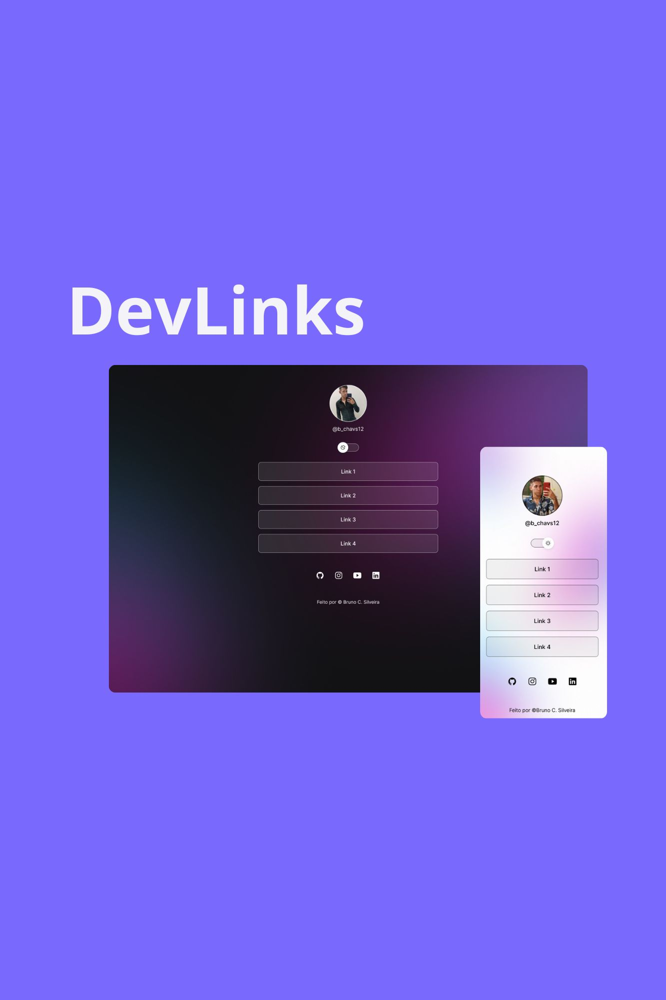

<h1 align="center"> Cartão de visitas online </h1>

Página para divulgação de marca pessoal contendo, projetos, portifólio e rede sociais.  

  <a href="#-tecnologias">Tecnologias</a>&nbsp;&nbsp;&nbsp;|&nbsp;&nbsp;&nbsp;
  <a href="#-projeto">Projeto</a>&nbsp;&nbsp;&nbsp;|&nbsp;&nbsp;&nbsp;
  <a href="#-layout">Layout</a>&nbsp;&nbsp;&nbsp;|&nbsp;&nbsp;&nbsp;
  <a href="#memo-licença">Licença</a>

  

 

  

## 🚀 Tecnologias

Esse projeto foi desenvolvido com as seguintes tecnologias:

- HTML e CSS
- JavaScript
- Git e Github
- Figma

## 💻 Projeto

Este projeto é um agregador de links para usar como cartão de visitas online.

- [Acesse o projeto finalizado, online](https://bchavs12.github.io/Cartao_visita_digital)

- [Outros projetos de minha autoria](https://github.com/bchavs12?tab=repositories)

## 🔖 Layout

Você pode visualizar o layout do projeto através [DESSE LINK](https://www.figma.com/design/ZZBJYRE926TDV9tXlWywLx/Cart%C3%A3o-de-visitas-online?node-id=0-1&node-type=canvas&t=3kMY5dBSzu7t5P9l-0). É necessário ter conta no [Figma](https://figma.com) para acessá-lo.

## 📝 Licença

Esse projeto está sob a licença MIT.

---

Feito por ©BSystems Inc.
